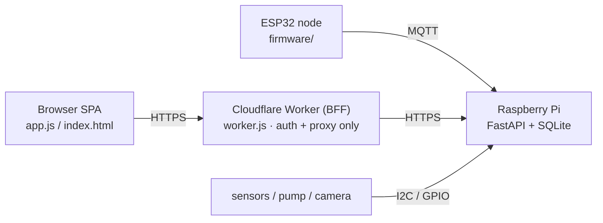

# 🌱 dewy

**[中文文档](README.zh-CN.md)** | English

An automated plant monitoring and watering system built on a **Raspberry Pi Zero 2 W**, fronted by a **Cloudflare Worker** edge proxy, with **ESP32** satellite sensor nodes. Four layers: ESP32 firmware → Pi backend → edge proxy → browser SPA.



- The **Pi** is the only tier that holds data and talks to hardware. It listens on `127.0.0.1:8000` and is reached by the Worker through a tunnel.
- The **Worker** (~90 lines) contains no business logic — it authenticates, proxies, and serves the static frontend.
- The **frontend** is a dependency-free single-page app served by the Worker; it calls the Pi API through the Worker's reverse proxy.

## Features

- **Live environment dashboard** — temperature, humidity, soil moisture, pressure per node, plus UPS power draw and system health (CPU / memory / disk). Any other numeric field a driver returns (illuminance, CO₂, EC …) gets its own card and a toggleable history series automatically — no frontend change needed.
- **Automatic watering** — checked daily at 06:00; the pump runs (default 0.5 s) only if > 12 h since the last watering and soil moisture is below threshold (default 50%). Manual watering via UI is clamped to 0.1–1.0 s.
- **Grow light scheduling** — fixed time window, or real sunrise/sunset computed from coordinates (IP geolocation fallback). Manual toggles auto-expire at the next schedule boundary.
- **Camera** — driven through the HAL (Pi CSI via `rpicam`, or any USB/IP camera via a command template): live preview, on-demand HD captures, a daily photo + thumbnail, a photo timeline player, and GIF export. When disk space runs low, old photos are thinned on a logarithmic curve (recent days stay dense; the last 7 days are never deleted).
- **UPS power saver** — on sustained battery discharge with no network, the Pi shuts down HDMI/LEDs/Wi-Fi and parks 3 CPU cores. A systemd watchdog guarantees the network comes back even if the service dies.
- **Multi-node** — add a plant by adding a node to `hardware_config.toml`; the UI gains a device switcher automatically.
- **Bilingual UI** (中文 / English), selected from `navigator.language` or `?lang=` / `#lang=`.
- **Hardware abstraction layer** — sensors and actuators are declared in TOML and their drivers discovered automatically from `hardware/drivers/`; adding a new sensor never requires touching core code or registering it anywhere.

## Repository layout

```
main.py                  Pi entrypoint: logging → FastAPI → background threads → MQTT
core/                    state, config, SQLite DAL, MQTT handler
core/logic/              watering, light, power, photo, scheduler, system
api/routers.py           all HTTP endpoints (router-level token dependency)
hardware/                hardware abstraction layer
  manager.py             reads config, discovers and loads drivers by name
  drivers/               15 drivers (SHT30, BME280, BH1750, AHT20, DHT, DS18B20,
                         ADS1115, INA219, GPIO/MQTT relay, rpicam, command camera,
                         HTTP, script, dummy)
worker.js                Cloudflare Worker: auth + reverse proxy + static assets
index.html / style.css / app.js / js/   frontend SPA (native ES modules, no build step)
firmware/plant_node/     ESP32 firmware (PlatformIO / Arduino)
power_saver.sh           power saver with auto-revert watchdog
scripts/                 DB migration, Pi setup helpers
  hardware_check/        interactive sensor/pump probes (need real hardware attached)
tests/                   automated unit tests: python3 -m unittest discover -s tests -t .
AGENTS.md                in-depth maintenance notes (Chinese)
```

## Getting started

### 1. Raspberry Pi backend

Requirements: Python 3.11+ (older versions need `tomli`), a local MQTT broker (e.g. Mosquitto) if you use ESP32 nodes.

```bash
pip install -r requirements.txt
cp hardware_config.example.toml hardware_config.toml   # then edit to match your hardware
python main.py                                          # serves 127.0.0.1:8000
```

On first start, a shared `PI_SECRET_TOKEN` is generated into `data/secret_token` (mode 600) and printed to the log — you will need it for the Worker.

User-tunable settings (auto water / auto light / photo capture) live in `data/config.json` and are editable from the UI's settings tab. Under photo capture, "fill light while capturing" applies to every capture path — live preview, HD grab, and the daily photo alike; the daily photo is one such capture, with its own toggle, capture hour, and a manual retake for today (overwriting takes a second confirming tap). Turning that toggle off stops the capture *and* hides the photo timeline from the history view.

### 2. Cloudflare Worker (edge proxy + frontend host)

```bash
# wrangler.toml: set PI_BASE_URL to the Pi's tunnel URL, then:
wrangler secret put PI_SECRET_TOKEN     # must match the Pi's token
wrangler secret put VIEWER_MAGIC_KEY    # read-only access key
wrangler secret put WATER_MAGIC_KEY     # key for watering / light / config
npx wrangler deploy
```

### 3. ESP32 firmware (optional satellite nodes)

Wi-Fi and MQTT credentials are injected at build time from the `[nodes.<id>]` section of `hardware_config.toml` by `firmware/plant_node/inject_config.py`.

```bash
pio run -t upload     # default env: esp32s3mini (lolin_s3_mini)
```

## Access & authentication

Three gates, progressively stricter:

1. **Read-only** (`/api/monitor`, `/api/history`, `/api/metrics`, `/api/nodes`, `/api/image`, `/api/photos*`): requires header `X-Viewer-Key` matching `VIEWER_MAGIC_KEY`; mismatches get a plain 404 so the endpoint's existence is never revealed.
2. **High-risk actions** (`/api/water`, `/api/light`, `/api/config`, `/api/photo/retake`): require `x-water-key` matching `WATER_MAGIC_KEY`. The two keys are independent.
3. **Worker → Pi**: every Pi endpoint requires `X-BFF-To-Pi-Token` matching `PI_SECRET_TOKEN`, enforced by a router-level dependency so new endpoints are protected by default.

Share access with a **fragment magic link** — fragments are never sent to the server, so keys stay out of edge logs and third-party Referers:

```
https://<your-worker-domain>/#key=<VIEWER_MAGIC_KEY>&water_key=<WATER_MAGIC_KEY>&lang=en
```

Without a key the page stays deliberately silent: no API calls, no prompts — it looks like an ordinary empty page.

## Configuration reference (Pi)

| Variable | Default | Purpose |
|---|---|---|
| `PI_SECRET_TOKEN` | auto-generated | Worker→Pi shared secret |
| `DEWY_DATA_DIR` | `<repo>/data` | database, photos, config, secrets |
| `DEWY_POWER_SAVER` | `<repo>/power_saver.sh` | power saver script path |
| `DEWY_DATA_RETENTION_DAYS` | `365` | days to keep sensor rows in `node_data` / `node_metrics` (`0` disables pruning) |
| `DEWY_NET_INTERFACE` | auto | interface name for the connectivity check; empty scans all physical interfaces |
| `DEWY_LOG_LEVEL` | `INFO` | log level |
| `DEWY_LOG_FILE` | unset | if set, also log to file (5 MB × 3 rotation) |
| `DEWY_UPS_SAMPLE_SEC` | `10` | fast-lane UPS current sampling interval |
| `DEWY_POWERSAVE_WATCHDOG_MIN` | `30` | watchdog timeout for power saver mode |

## Adding a sensor or actuator

1. Drop a `.py` file in `hardware/drivers/` with a class implementing `__init__(**kwargs)` plus `read()` (sensors) or `trigger(**kwargs)` (actuators).
2. Declare it in `hardware_config.toml` — `driver` may be the module name or the class name.

Drivers are discovered automatically; there is no registry to update. No changes to `manager.py`, `core/` or `api/` are needed. Generic `http_sensor` and `script_sensor` drivers can integrate external data sources without writing any Python. See [hardware/README.md](hardware/README.md).

## Database

SQLite in WAL mode, four tables: `node_data` (environment samples in fixed columns) and `node_metrics` (any other numeric field a driver returns, as `node_id/key/value` rows) — both pruned after retention — plus `watering_log` and `photo_log` (kept indefinitely). All SQL lives in `core/database.py`; timestamps are UTC.

## Development notes

- The frontend has **no build step** — native ES modules served as text by the Worker. When adding a `js/` module, update three places: `worker.js` (`JS_MODULES`), `index.html` (`modulepreload`), and the importing module.
- `AGENTS.md` (Chinese) documents the layering rules, concurrency locks, the power-saver watchdog, and many "looks wrong but is intentional" behaviors. Read it before modifying core logic.
