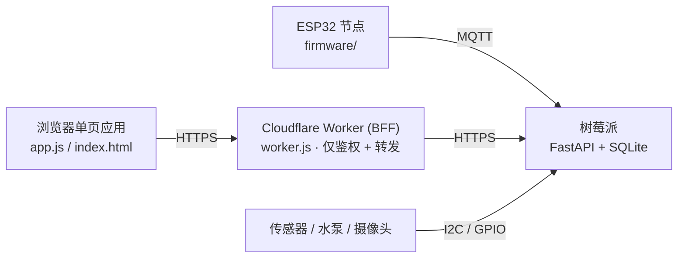

# 🌱 dewy

**[English](README.md)** | 中文

基于**树莓派 Zero 2 W** + **Cloudflare Workers** 边缘代理的植物自动化监控与浇水系统，支持 **ESP32** 卫星传感节点。四层架构：ESP32 固件 → 树莓派后端 → 边缘代理 → 浏览器单页应用。



- **树莓派**是唯一持有数据和硬件的一端，只监听 `127.0.0.1:8000`，经隧道由 Worker 访问。
- **Worker**（约 90 行）不含业务逻辑，只做鉴权、转发和下发静态前端。
- **前端**由 Worker 下发，通过 Worker 反代调用树莓派 API。

## 功能

- **实时环境面板**：按节点展示温湿度、土壤湿度、水温、气压，以及 UPS 功耗与系统健康（CPU / 内存 / 磁盘）。驱动返回的其它数值字段（照度、CO₂、EC、水温等）会自动获得独立卡片与可折叠的历史曲线，无需改前端。
- **ESP32 节点与动态远程配置**：支持植物与鱼缸监控节点。在 TOML 中声明 `settings_schema` 后，前端设置页会自动生成对应参数表单（如水温报警阈值、喂食重置时刻），保存后经 MQTT 实时下发至 ESP32 并写入 NVS 掉电存储。
- **自动浇水**：每天 06:00 检查，距上次浇水超过 12 小时且土壤湿度低于阈值（默认 50%）时启泵（默认 0.5 秒）。手动浇水时长被钳制在 0.1 到 1.0 秒。
- **补光灯调度**：固定时段，或按经纬度实时推算日出日落（缺经纬度时用 IP 定位）。手动切灯在下一个定时边界自动失效。
- **摄像头**：经硬件抽象层驱动（树莓派 CSI 用 `rpicam`，USB/网络摄像头用命令模板）：实时预览、高清抓拍、每日一张照片 + 缩略图、照片时间轴播放器与 GIF 导出。磁盘不足时按对数曲线稀疏化历史照片（近期密集、远期稀疏，最近 7 天永不删除）。
- **UPS 省电模式**：持续放电且无网络时自动关 HDMI/LED、断 WiFi、下线 3 个 CPU 核；内置 systemd 看门狗，即使服务崩溃也能保证网络自动恢复。
- **多节点**：在 `hardware_config.toml` 里加一个节点即多一个监测对象，前端自动出现设备切换。
- **中英双语界面**：按 `navigator.language` 自动选择，或用 `?lang=` / `#lang=` 指定。
- **硬件抽象层**：传感器与执行器在 TOML 中声明，驱动从 `hardware/drivers/` 自动发现，新增器件无需改动核心代码、也无需在任何地方登记。

## 目录结构

```
main.py                  树莓派入口：日志 → FastAPI → 后台线程 → MQTT
core/                    全局状态、用户配置、SQLite 数据访问层、MQTT 处理
core/logic/              浇水、灯控、省电、拍照、调度主循环、系统信息
api/routers.py           全部 HTTP 端点（路由级密钥校验，新端点默认受保护）
hardware/                硬件抽象层
  manager.py             读配置、按名字发现并加载驱动
  drivers/               15 个驱动（SHT30、BME280、BH1750、AHT20、DHT、DS18B20、
                         ADS1115、INA219、GPIO/MQTT 继电器、rpicam、命令行相机、
                         HTTP、脚本、dummy）
worker.js                Cloudflare Worker：鉴权 + 反代 + 下发静态资源
index.html / style.css / app.js / js/   前端单页应用（原生 ES 模块，无构建步骤）
firmware/plant_node/     ESP32 固件（PlatformIO / Arduino）
power_saver.sh           带自动恢复看门狗的省电脚本
scripts/                 数据库迁移、树莓派初始化脚本
  hardware_check/        传感器/水泵的交互式排查脚本（需接真实硬件）
tests/                   自动化单元测试：python3 -m unittest discover -s tests -t .
AGENTS.md                深入维护笔记（分层约定、看门狗、既有行为说明）
```

## 快速开始

### 1. 树莓派后端

要求：Python 3.11+（低版本需装 `tomli`）；系统工具 `python3-dev`、`build-essential` 与 `ffmpeg`；使用 ESP32 节点时需要本地 MQTT broker（如 Mosquitto）。

```bash
sudo apt update
sudo apt install -y python3-dev build-essential ffmpeg   # 系统编译与视频工具
pip install -r requirements.txt
cp hardware_config.example.toml hardware_config.toml   # 按实际硬件修改
python main.py                                          # 监听 127.0.0.1:8000
```

首次启动会自动生成共享密钥 `PI_SECRET_TOKEN`，写入 `data/secret_token`（权限 600）并打印到启动日志——Worker 端需要用到它。

用户可调配置（自动浇水 / 补光灯 / 拍照）存于 `data/config.json`，可在前端设置页修改。拍照一组里，「拍照时开启补光灯」对实时预览、高清抓拍与每日照片一并生效；每日照片是其中一种拍摄，可单独开关、设定时刻，并手动重拍当日照片（覆盖前需二次确认）；关掉这个开关后，后台不再拍，历史里的「照片」栏目也一并收起。

### 2. Cloudflare Worker（边缘代理 + 前端托管）

```bash
# wrangler.toml：将 PI_BASE_URL 设为树莓派的隧道地址，然后：
wrangler secret put PI_SECRET_TOKEN     # 必须与树莓派端一致
wrangler secret put VIEWER_MAGIC_KEY    # 只读访问密钥
wrangler secret put WATER_MAGIC_KEY     # 浇水 / 灯控 / 配置密钥
npx wrangler deploy
```

### 3. ESP32 固件（可选卫星节点）

WiFi 与 MQTT 凭据由 `firmware/plant_node/inject_config.py` 在构建时从 `hardware_config.toml` 的 `[nodes.<id>]` 段注入。

```bash
pio run -t upload     # 默认环境：esp32s3mini（lolin_s3_mini）
```

## 访问与鉴权

三道关卡，逐级收紧：

1. **只读端点**（`/api/monitor`、`/api/history`、`/api/metrics`、`/api/nodes`、`/api/image`、`/api/photos*`）：要求请求头 `X-Viewer-Key` 匹配 `VIEWER_MAGIC_KEY`，不匹配一律返回 404，不暴露端点存在。
2. **高危操作**（`/api/water`、`/api/light`、`/api/config`、`/api/photo/retake`）：要求 `x-water-key` 匹配 `WATER_MAGIC_KEY`。两把钥匙互相独立。
3. **Worker → 树莓派**：所有端点要求 `X-BFF-To-Pi-Token` 匹配 `PI_SECRET_TOKEN`，挂在路由级依赖上，新增端点默认自动受保护。

分享访问请用**片段魔法链接**——fragment 不随请求上行，密钥不会进入边缘访问日志，也不会泄漏到第三方 Referer：

```
https://<你的-worker-域名>/#key=<VIEWER_MAGIC_KEY>&water_key=<WATER_MAGIC_KEY>&lang=zh
```

没有密钥时页面刻意保持静默：不发任何 API 请求、不显示任何提示，看起来就是一个普通的空页面。

## 配置项（树莓派端）

| 环境变量 | 默认值 | 说明 |
|---|---|---|
| `PI_SECRET_TOKEN` | 自动生成 | Worker→树莓派共享密钥 |
| `DEWY_DATA_DIR` | `<项目根>/data` | 数据目录（数据库、照片、配置、密钥） |
| `DEWY_POWER_SAVER` | `<项目根>/power_saver.sh` | 省电脚本路径 |
| `DEWY_DATA_RETENTION_DAYS` | `365` | 传感器数据保留天数（设 0 关闭清理） |
| `DEWY_NET_INTERFACE` | 自动 | 网络连通性检查用的网卡名，留空则扫描所有物理网卡 |
| `DEWY_LOG_LEVEL` | `INFO` | 日志级别 |
| `DEWY_LOG_FILE` | 未设 | 设置后额外落盘（5MB × 3 份轮转） |
| `DEWY_UPS_SAMPLE_SEC` | `10` | UPS 电流快档采样间隔（秒） |
| `DEWY_POWERSAVE_WATCHDOG_MIN` | `30` | 省电模式看门狗超时（分钟） |

## 新增传感器 / 执行器

1. 在 `hardware/drivers/` 下新建一个 `.py`，类里实现 `__init__(**kwargs)`，以及 `read()`（传感器）或 `trigger(**kwargs)`（执行器）。
2. 在 `hardware_config.toml` 里声明，`driver` 写模块名或类名均可。

驱动会被自动发现，不需要在任何注册表里登记，也不需要改动 `manager.py`、`core/` 或 `api/`。通用的 `http_sensor` 与 `script_sensor` 驱动可以不写 Python 就接入外部数据源。详见 [hardware/README.md](hardware/README.md)。

## 数据库

SQLite（WAL 模式），四张表：`node_data`（环境采样的固定列）与 `node_metrics`（驱动返回的其它数值字段，按 `node_id/key/value` 存）——两者都超期清理——以及 `watering_log` 与 `photo_log`（永久保留）。所有 SQL 集中在 `core/database.py`，时间戳统一用 UTC。

## 开发须知

- 前端**无构建步骤**——原生 ES 模块由 Worker 以文本形式下发。新增 `js/` 模块要同步改三处：`worker.js` 的 `JS_MODULES`、`index.html` 的 `modulepreload`、以及 import 它的模块。
- `AGENTS.md` 详细记录了分层约定、并发锁、省电看门狗以及大量"看着像 bug 实则有意为之"的既有行为，改动核心逻辑前请先阅读。
